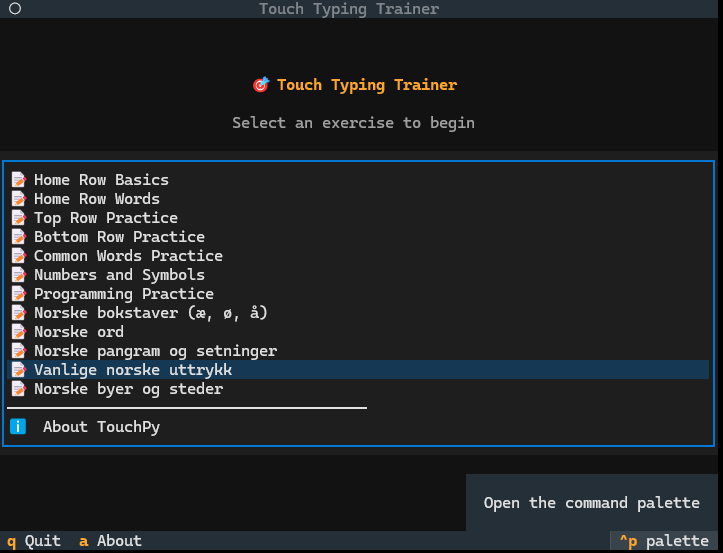
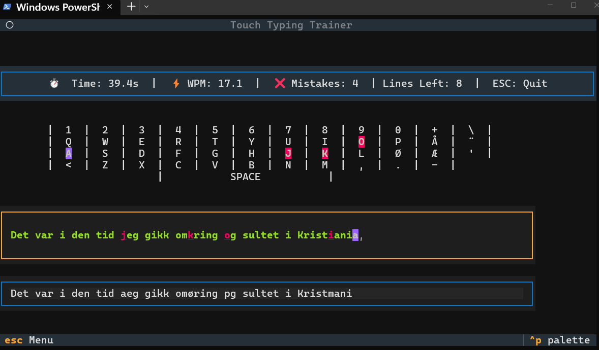

# TouchPy 🎯

A beautiful terminal-based touch typing trainer built with Python, Textual, and Rich.

## Screenshots




## Features

- 🎨 **Beautiful Terminal UI** - Modern, colorful interface using Textual
- ⚡ **Real-time Feedback** - See your typing speed (WPM) and accuracy live
- 🎯 **Visual Highlighting** - Correct characters in green, mistakes in red
- ❌ **Mistake Tracking** - See how many errors you make in real-time
- 📚 **Multiple Exercises** - 17+ built-in exercises including Norwegian texts
- 🇳🇴 **Norwegian Support** - Special exercises for æ, ø, å and Norwegian literature
- ➕ **Custom Exercises** - Add your own .txt files without rebuilding
- ⏱️ **Automatic Timer** - Timer starts when you begin typing
- 📊 **Performance Summary** - Get detailed stats after each exercise
- ✏️ **Backspace Support** - Fix mistakes as you type
- 🚪 **Easy Exit** - Press ESC anytime to return to menu

## Installation

1. **Clone the repository** (if you haven't already):

   ```bash
   git clone https://github.com/magnussimonsen/TouchPy.git
   cd TouchPy
   ```

2. **Install dependencies**:
   ```bash
   pip install -r requirements.txt
   ```

## Usage

Run the typing trainer:

```bash
python run.py
```

Or run directly from the typing_trainer directory:

```bash
cd typing_trainer
python app.py
```

## Building to Executable (.exe)

You can build TouchPy into a standalone Windows executable that doesn't require Python to be installed!

### Quick Build

Run the automated build script:

```powershell
.\build.ps1
```

This will create `dist\TouchPy\TouchPy.exe` that you can share with others.

### Distribution

After building:

1. The executable is in `dist\TouchPy\TouchPy.exe`
2. Share the entire `dist\TouchPy` folder
3. Users can run `TouchPy.exe` directly (no Python needed!)

For detailed build instructions and customization options, see [BUILD.md](BUILD.md).

## Adding Custom Exercises

**For .exe users:** You can add new exercises without rebuilding!

1. Create an `exercises` folder next to `TouchPy.exe`
2. Add `.txt` files with this format:
   - Line 1: Exercise title
   - Rest: Exercise text

See [EXERCISES_README.md](EXERCISES_README.md) for detailed instructions.

**For developers:** Add `.txt` files to `typing_trainer/exercises/` or `exercises/` folder.

## Built-in Exercises

TouchPy includes several exercise categories:

### Basic Exercises

- Home Row Basics
- Home Row Words
- Top Row Practice
- Bottom Row Practice
- Common Words Practice
- Numbers and Symbols
- Programming Practice

### Norwegian Exercises (Norske øvelser)

- Norske bokstaver (æ, ø, å)
- Norske ord
- Norske pangram og setninger
- Vanlige norske uttrykk
- Norske byer og steder

### Norwegian Literature (Norsk litteratur)

- Fra Knut Hamsun - "Sult" (1890)
- Fra Sigrid Undset - "Jenny" (1911)
- Fra Nordahl Grieg - "Ung må verden ennu være" (1938)
- Fra Johan Bojer - "Den siste viking" (1921)
- Fra Olav Duun - "Juvikingar" (1918)

All classic literature texts are from works published before 1955 and are in the public domain.

## How to Use

1. **Select an Exercise** - Use arrow keys to navigate the menu, press Enter to select
2. **Start Typing** - The timer starts automatically when you type the first character
3. **Multi-line Exercises** - Press Enter to move to the next line when you reach the end of a line
4. **Watch Your Progress** - See real-time WPM, accuracy, and mistake count as you type
5. **Complete the Exercise** - Type the entire text correctly to finish
6. **Review Your Results** - Get a summary with your speed, accuracy, time, and mistakes

### Keyboard Shortcuts

- **Arrow Keys** - Navigate menu
- **Enter** - Select exercise (in menu) or move to next line (while typing)
- **Escape** - Return to menu from typing view
- **Q** - Quit from main menu
- **Backspace** - Correct mistakes while typing

## Project Structure

```
TouchPy/
├── typing_trainer/
│   ├── app.py                 # Main application
│   ├── models.py              # Exercise data model
│   ├── services/
│   │   ├── loader.py          # Exercise file loader
│   │   └── metrics.py         # WPM and accuracy calculations
│   ├── views/
│   │   ├── menu_view.py       # Exercise selection screen
│   │   ├── typing_view.py     # Main typing practice screen
│   │   ├── summary_view.py    # Results screen
│   │   └── about_view.py      # About/credits screen
│   └── exercises/             # Built-in exercises
│       ├── 001_home_row.txt
│       ├── 008_norwegian_letters.txt
│       ├── 013_hamsun.txt
│       └── ...
├── exercises/                  # Custom exercises (not in git)
│   └── (add your own .txt files here)
├── requirements.txt
├── requirements-build.txt
├── build.ps1
├── TouchPy.spec
├── BUILD.md
├── EXERCISES_README.md
├── run.py
└── README.md
```

## Technical Details

3. **Top Row Practice** - Practice the top row keys (qwerty uiop)
4. **Bottom Row Practice** - Practice the bottom row keys (zxcvbnm)
5. **Common Words Practice** - Famous pangrams like "the quick brown fox"
6. **Numbers and Symbols** - Practice numbers and special characters
7. **Programming Practice** - Python code snippets

## Technology Stack

- **[Textual](https://github.com/Textualize/textual)** - Terminal UI framework
- **[Rich](https://github.com/Textualize/rich)** - Beautiful text formatting
- **Python 3.8+**

## Requirements

- Python 3.8 or higher
- textual >= 0.50.0
- rich >= 13.7.0

## Contributing

Feel free to contribute by:

- Adding new exercises
- Improving the UI
- Fixing bugs
- Adding new features

## License

MIT License - feel free to use this project for learning and teaching!

## Tips for Better Touch Typing

1. 🪑 **Proper Posture** - Sit up straight with feet flat on the floor
2. 👀 **Look at the Screen** - Not at your keyboard!
3. 🏠 **Home Row Position** - Keep fingers on asdf and jkl;
4. 🎯 **Accuracy First** - Speed will come naturally with practice
5. 📅 **Practice Daily** - Even 15 minutes a day makes a difference
6. 🔄 **Repeat Exercises** - Muscle memory improves with repetition

Happy typing! 🚀
